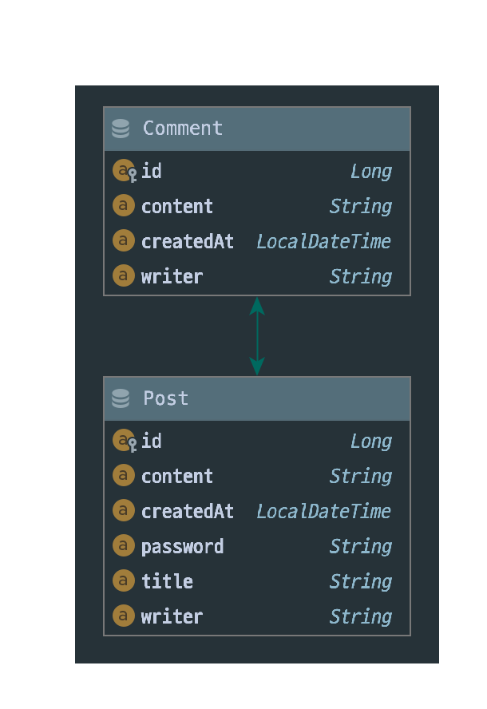

# 백엔드 채용 과제

## 주제

간단한 게시판 구현하기

## 기술 스택 및 라이브러리

- Spring boot
- Spring Data JPA
- Mysql
- lombok

## 프로젝트 설명

<strong>게시글</strong>과 <strong>댓글</strong> 로 이루어진 간단한 CRUD 구현 프로젝트입니다.

<ul>
<li>
게시글 엔티티는 id, title, content, writer, password, createdAt 으로 구성되어있습니다.
</li>
<li>
댓글 엔티티는 id, post, writer, content, createdAt 으로 구성되어 있습니다.
</li>
<li>
댓글과 게시글은 서로 N : 1 연관관계입니다.
</li>
<li>
과제에서는 게시글에 password 컬럼이 존재하지 않았으나, validator 구현을 위해서 추가해봤습니다.
</li>
</ul>

<strong>Restful API Controller</strong>, <strong>Mvc Controller</strong> 모두 구현해뒀습니다. 따라서 웹 페이지 상에서도 사용해 보실 수 있습니다. 
 
<h3>Restful API Controller의 <strong>엔드포인트</strong>는 다음과 같습니다.</h3>

<h4><strong>Post</strong></h4>
<ul>
<li>
<strong>GET</strong> /api/post/all : <strong>DB에 존재하는 모든 게시글들을</strong> 페이징 처리하여 조회합니다. QueryDSL을 사용하여 게시글과 게시글의 댓글까지 모두 가져오면서 N + 1 이슈를 해결했습니다.
</li>
 
<li>
<strong>GET</strong> /api/post/게시글의 ID : ID에 해당하는 게시글과 포함된 댓글을 가져옵니다. 존재하지 않으면 에러 메시지를 출력합니다. 
</li>
 
<li>
<strong>POST</strong> /api/post/new : 새로운 게시글을 생성합니다. RequestBody 부분에 JSON 형식으로 title, content, writer, password 를 넘겨줘야 합니다. 
만약 하나라도 빈 문자열이 넘겨지면 에러 메시지를 출력합니다.
</li>
 
<li>
<strong>POST</strong> /api/post/edit : 게시글을 수정합니다. RequestBody 부분에 JSON 형식으로 id, title, content, writer, password를 넘겨줘야 합니다. 
해당 데이터들이 컨트롤러로 넘어가게 되면 Validator 를 활용하여 존재하는 id인지, password가 일치하는지 검증하게 됩니다. 만약 validator에 의해 걸러지게 되면 에러메시지를 출력하게 됩니다.
</li>
 
<li>
<strong>DELETE</strong> /api/post/delete/게시글의 ID : ID에 해당하는 게시글을 삭제합니다. 만약 존재하지 않는 게시글이라면 에러 메시지를 출력합니다. 
라면 에러 메시지를 출력합니다. 
삭제는 게시글의 내용을 null로 만듭니다. 게시글 내용이 null인 객체는 /api/post/all API 를 제외하고는 더는 조회되지 않습니다.
</li>
</ul>

<h4><strong>Comment</strong></h4>
<ul>
<li>
<strong>GET</strong> /api/comment/all : <strong>DB에 존재하는 모든 댓글들을</strong> 페이징 처리하여 조회합니다.
</li>
 
<li>
<strong>GET</strong> /api/comment/댓글의 ID : ID에 해당하는 댓글을 가져옵니다. 존재하지 않으면 에러 메시지를 출력합니다. 
</li>
 
<li>
<strong>POST</strong> /api/comment/new : 새로운 댓글을 생성합니다. RequestBody 부분에 JSON 형식으로 postId, writer, content 를 넘겨줘야 합니다. 
validator를 활용하여 존재하지 않는 postId면 에러 메시지를 출력합니다.
</li>
 
<li>
<strong>POST</strong> /api/comment/edit : 댓글을 수정합니다. RequestBody 부분에 JSON 형식으로 id, writer, content 를 넘겨줘야 합니다. 
해당 데이터들이 컨트롤러로 넘어가게 되면 Validator 를 활용하여 존재하는 id인지 검증하게 됩니다.
</li>
 
<li>
<strong>DELETE</strong> /api/comment/delete/게시글의 ID : ID에 해당하는 댓글을 삭제합니다. 만약 존재하지 않는 댓글이라면 에러 메시지를 출력합니다. 
삭제는 댓글의 내용을 null로 만듭니다. 댓글 내용이 null인 객체는 /api/comment/all API 를 제외하고는 더는 조회되지 않습니다.
</li>
</ul>

## 프로젝트 환경

<strong>dev</strong> 프로파일로 실행하게 되면 프로젝트 기동 시에 샘플 데이터들이 추가됩니다. 샘플 게시글들의 기본 비밀번호는 11111111 입니다.  
<strong>dev</strong> 프로파일로 실행 시에는 h2Database 의 메모리 DB 를 사용하게 됩니다. 
<strong>prod</strong> 프로파일로 실행 시에는 mysql을 사용하게 됩니다. 사용자는 application-prod.yml 파일에 db의 url, username, password 를 입력해야 합니다.